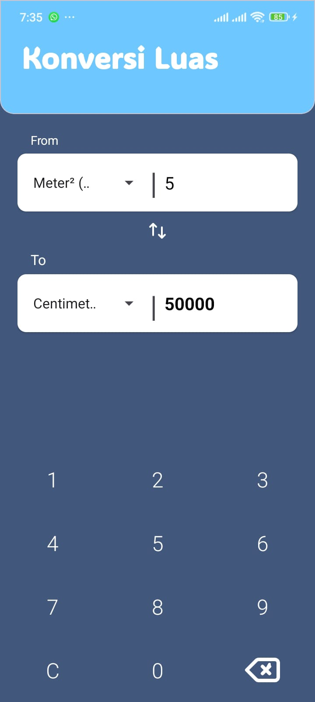
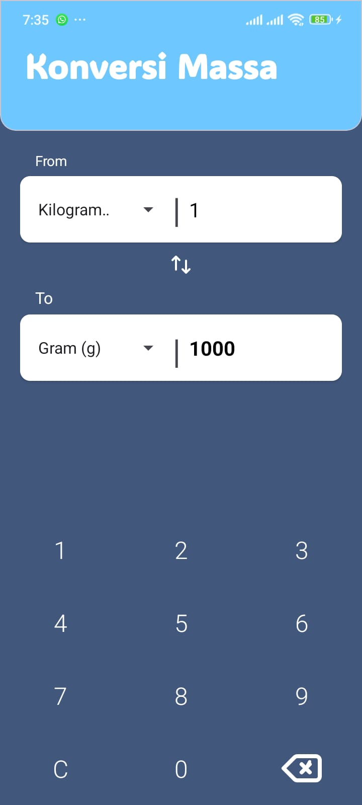
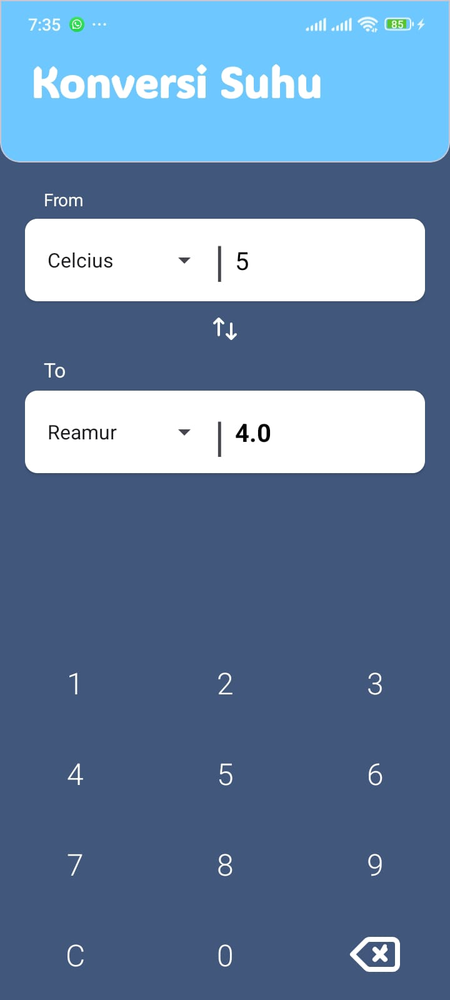

# 🧮 APK Konversi

## 1. Deskripsi Umum
**APK Konversi** merupakan aplikasi Android sederhana yang berfungsi untuk melakukan **konversi satuan** dalam berbagai kategori seperti **jarak, luas, massa, dan suhu**.  
Aplikasi ini dikembangkan sebagai bagian dari pembelajaran pemrograman mobile, dengan tujuan memberikan antarmuka yang mudah digunakan serta hasil konversi yang akurat.

---

## 2. Fitur Utama
Aplikasi ini memiliki beberapa fitur konversi utama, antara lain:

- 🔹 **Konversi Jarak** – meter, kilometer, mil, kaki, dan lainnya.  
- 🔹 **Konversi Luas** – meter persegi, hektar, dan satuan luas lain.  
- 🔹 **Konversi Massa** – gram, kilogram, ons, dan pon.  
- 🔹 **Konversi Suhu** – Celcius, Fahrenheit, Kelvin.  
- 🔹 **Tampilan Antarmuka Sederhana** – mudah dipahami oleh pengguna.  
- 🔹 **Splash Screen** sebagai halaman pembuka aplikasi.

---

## 3. Tampilan Aplikasi

Berikut beberapa cuplikan layar dari aplikasi:

<p align="center">
  <br/>
  <em>Gambar 1. Splash Screen</em>
</p>

<p align="center">
  <br/>
  <em>Gambar 2. Menu Utama</em>
</p>

<p align="center">
  <br/>
  <em>Gambar 3. Tampilan Konversi Jarak</em>
</p>

<p align="center">
  <br/>
  <em>Gambar 4. Tampilan Konversi Luas</em>
</p>

<p align="center">
  <br/>
  <em>Gambar 5. Tampilan Konversi Massa</em>
</p>

<p align="center">
  <br/>
  <em>Gambar 6. Tampilan Konversi Suhu</em>
</p>

---

## 4. Teknologi yang Digunakan
- **Bahasa Pemrograman:** Java  
- **Lingkungan Pengembangan:** Android Studio  
- **Target Platform:** Android (APK)  
- **Versi Minimum SDK:** API Level 19 (Android 4.4 KitKat)

---

## 5. Cara Menjalankan Aplikasi

1. Clone repositori ini ke komputer lokal:
   ```bash
   git clone https://github.com/muhaqilhasan/APK_Konversi.git
